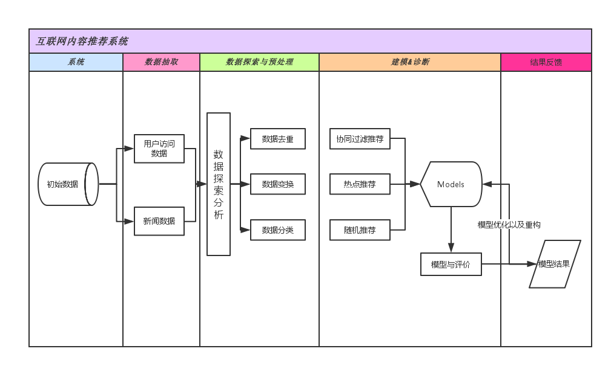

## 互联网内容推荐系统需求分析

### 互联网内容推荐系统：

内容爬虫­——对若干新闻网站或论坛进行爬取和解析；

特征提取——通过文本分析技术对每一篇文章内容进行特征的提取；

用户兴趣建模——记录用户阅读行为，并进行用户兴趣画像；

推荐算法——通过特定的推荐策略，将新闻内容推荐给用户。

### 1.目标

- [ ] **内容爬取**


- [ ] **分析用户的需求和行为，帮助用户发现他们感兴趣的新闻**


- [ ] **将用户行为分析结果与新闻内容进行比较，实现动态新闻推荐**

### 2.数据获取

- [ ] **首先需要获取初始数据，其目前分为两部分：**

      1.*爬取的新闻数据*

      2.*用户的访问数据*

- [ ] **如何获取数据：**

      ​*以`python`语言进行新闻数据的爬取，基础教程参考[廖雪峰老师的教程](http://www.liaoxuefeng.com/wiki/0014316089557264a6b348958f449949df42a6d3a2e542c000)，在内容爬取过程中，最好使用框架进行爬取，可以参考[scarpy官方文档中文版](http://scrapy-chs.readthedocs.io/zh_CN/latest/)*

### 3.数据分析与挖掘

​	**获得初始数据，下一步进行数据分析与挖掘：**

#### 3-1：挖掘目标

​	1.*根据用户所处的地域、性别、年龄、访问的时间、访问的新闻类别、某个新闻点开的次数、该新闻阅读到哪里等进行分析，从而了解用户的行为*

​	2.*根据第一步的分析结果，对不同需求的用户进行相关的新闻推荐，实现动态推荐*

#### 3-2：分析方法以及过程

##### 3-2-1：概要

##### 

​	1.获得初始数据（用户的原始记录，新闻数据）

​	2.对用户的访问内容，流失的用户，用户的分类进行分析

​	3.对数据进行预处理

​	4.对比多种推荐算法进行推荐，通过模型评价得到比较好的智能推荐模式

##### 3-2-2：数据抽取

​	本项目的推荐是建立在用户行为的基础上，所以在设计推荐算法之前，分析用户行为数据必不可少，首先需要建立分析用户行为的数据表，该表包含用户对已经出现的新闻的一系列动作，news.behavior表如下（具体参照数据库设计文档）：

|      字段       |             说明             |
| :-----------: | :------------------------: |
|    user_id    |            唯一用户            |
|    news_id    |            目标新闻            |
| behavior_type |     对该新闻的行为类型：浏览、喜欢、跳过     |
|    context    |       在什么时间地点产生这个行为        |
|    weight     |       浏览时间戳前后差值作为权重        |
|    content    |           给与评论否            |
|   news_way    |        搜索或者推荐方式阅读新闻        |
|    scores     | 特定用户对特定新闻的分数（下面详细说这个分数怎么算） |
|      age      |             年龄             |

​	目的是分析出如下表格式的数据（每个用户对新闻的标签喜欢程度）：

| 用户      | 科技   | 搞笑   | 娱乐   | 体育   | 历史   |
| ------- | ---- | ---- | :--- | ---- | ---- |
| howie-1 | 0.8  | 0.1  | 0.2  | 0.2  | 0.6  |

​	关于对于新闻的处理，个人觉得在这部分就进行算法分析，首先将新闻分为两部分：

​	1.*旧新闻*：对用户推荐过，获得反馈的新闻，以这些新闻为标准，得出该新闻标签的标准；对于旧新闻，又分为两种情况：被用户阅读的新闻和未被用户阅读的新闻，处理后的表大概是这个样子：

|         | news-1 | news-2 | news-3 | news-4 | news-5 | news-6 |
| ------- | ------ | ------ | ------ | ------ | ------ | ------ |
| howie-1 | 5      | 0      | 10     | 5      | 0      | 5      |
| howie-2 | 0      | 0      | 10     | 5      | 0      | 0      |

​	2.*新新闻*：刚刚经过第一步处理的新闻，尚未被推荐的新闻，以老新闻分析出来的标准为标准，进行分析，主要目的是算出该新闻的分数。

​	目的是分析出如下表格式的数据（各新闻的标签因子）：

| 新闻     | 科技   | 搞笑   | 娱乐   | 体育   | 历史   |
| ------ | ---- | ---- | ---- | ---- | ---- |
| news-1 | 0.2  | 0.1  | 0.1  | 0    | 0    |

​	综合这两部分数据，就可以得出该用户对某个新闻的新欢程度，即：
$$
S = \sum_{i,j=0}^\infty {f_i(i)}{f_j(j)}
$$
​	现假使系统获取了大量数据，但这些数据并不是完全可用，所以要进行下一步对数据进行处理，得到**用户行为数据集和新闻数据集**。

##### 3-2-3：数据探索分析

​	在数据探索分析的过程中，肯定会发现与分析目标无关的数据，针对这个问题的数据处理方式有：数据清洗、数据集成和数据变换。

​	1.*数据清洗*

​	清除毫无意义的评论数据

​	2.*数据变换*

​	有些数据可能某个字段不准确，比如无法获取位置导致这个字段为空，不给与评论也不给标签，对于这些问题：

​	第一种情况：考虑到某些用户关闭定位功能，可以考虑结合其上次浏览的位置以及初始位置进行替换`context`内容。

​	第二种情况：使用默认的新闻分类标签

​	3.*数据去重*

​	删除重复数据

​	经过上面一系列步骤之后，可以得出我们想要的数据集：**用户行为数据集和新闻数据集**，下面就要对用户行为进行分析，了解其中的的一般规律。可以考虑使用长尾分布：这可以得出`80%`用户喜欢的`20%`内容，反之亦然。
$$
f(x)=\alpha x^k	（k<0）
$$
​	或许可以不要这一步，毕竟数据量没有那么多。

##### 3-2-4：建立模型

​	本项目需要根据用户的行为实现新闻推荐，可以考虑使用**协同过滤算法和潜在因子(Latent Factor)算法**.

​	对于*协同过滤算法*，学术界提出了很多办法，比如*基于邻域的方法（neighborhood-based）*、*隐语义模型*、*基于图的随机游走算法*

​	基于邻域的方法应用程度比较高，所以采用基于邻域的方法，此方法主要包含以下两种算法：

​	1.基于用户的协同过滤算法：给用户推荐和其兴趣相似的其他用户喜欢的物品。

​	2.基于物品的协同过滤算法：给用户推荐和其之前喜欢的物品形似的物品。

​	不论使用那一种算法，首先需要将数据集随机分成（M）份，一份作为测试集，剩下作为训练集，随即在训练集上建立模型，测试集上对用户行为进行预测，参考代码如下：

```python
import random
#假设数据类型为列表
def dataGroup(data,M):
    practice = []	#训练集
    for i in random.randint(0,int(len(data)/M)):
        practice.append(data[i])
        del data[i]
    test = data		#剩下的便是测试集
```

​	目前暂时采用基于用户的协同过滤算法，以为一开始用户的数据量少于新闻量，基于用户的协同过滤算法主要包括以下两个步骤：

​	1.计算用户之间的相似度

​	2.根据用户的相似度和用户的历史行为给用户生成推荐列表

​	对于步骤一：假设用户a和用户b，怎么计算这两个用户的相似度，可以通过Jaccard公式进行计算，最终是要得到用户的兴趣相似度，然后比较相似度相似的用户，进行新闻推荐。

​	对于*潜在因子(Latent Factor)算法* ，每个用户都有自己的感兴趣的地方，就新闻而言，可以将一个新闻分成几个兴趣点（这里兴趣点指的是上表字段content的标签），对用户而言，这些数据就表示对含有这些标签的新闻的标签喜欢程度；对新闻而言，我将这些数据称之为标签因子，用于计算该新闻能被用户喜欢到什么程度，具体看下表：

| 用户      | 科技   | 搞笑   | 娱乐   | 体育   | 历史   | 当前城市 |
| ------- | ---- | ---- | :--- | ---- | ---- | ---- |
| howie-1 | 0.8  | 0.1  | 0.2  | 0.2  | 0.6  | 1    |
| howie-2 | 0.5  | 0.4  | 0.4  | 1    | 0.5  | 0    |

| 新闻     | 科技   | 搞笑   | 娱乐   | 体育   | 历史   | 当前城市 |
| ------ | ---- | ---- | ---- | ---- | ---- | ---- |
| news-1 | 0.2  | 0.1  | 0.1  | 0    | 0    | 1    |
| news-2 | 0    | 0.2  | 0.2  | 0    | 1    | 1    |

​	怎么计算呢？可以这样算出某个用户对某个新闻的喜欢程度:

​	howie-1和news-1：
$$
result1=0.8*0.2+0.1*0.1+0.2*0.1+0.2*0+0.6*0+1*1=1.19
$$
​	howie-1和news-2：
$$
result2=0.8*0+0.1*0.2+0.2*0.2+0.2*0+0.6*1+1*1=1.66
$$
​	howie-2和news-1：
$$
result3=0.5*0.2+0.4*0.1+0.4*0.1+1*0+0.5*0+0*1=0.18
$$
​	howie-2和news-2：
$$
result4=0.5*0+0.4*0.2+0.4*0.2+1*0+0.5*1+0*1=0.66
$$
​	很明显，用户howie-1可以被推荐news-2，用户howie-2也可以被推荐news-2，当然，目前数据量很少，没有说明性，仅仅是举例。

|         | news-1 | news-2 |
| :-----: | :----: | :----: |
| howie-1 |  1.19  |  1.66  |
| howie-2 |  0.18  |  0.66  |

​	所以，综上，系统推荐可以先利用协同过滤算法，分析出一些新闻数据集合   `U`  ，与此同时，也通过潜在因子算法分析出一些新闻数据集合`R`，再利用公式：
$$
top_i = U \cap R
$$
​	根据计算结果，便可以得出需要推荐的前   `i` 条新闻，排序规则依据每条新闻被用户喜欢程度的数据大小。

​	至此，模型构建成功，下一步进行测试。

### 4.结果分析

​	将计算结果与实际结果进行比较，将产生的结果反馈给模型，从而进一步优化。


​	

