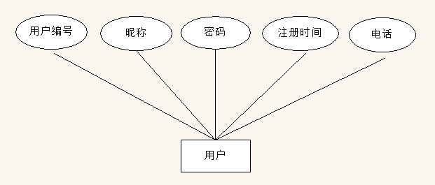
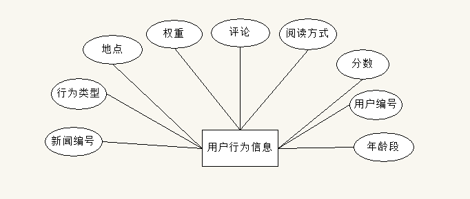
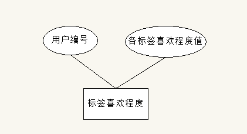

## 互联网内容推荐系统数据库设计

### 1.环境要求

​	语言：`python3.5`

​	数据库：`mysql5.0`以上

​	系统：`linux`系列皆可

### 2.数据库需求分析

​	对于互联网内容推荐系统，经过分析后，设计的数据项和数据结构如下：

| 名称         | 数据项                                      |
| :--------- | :--------------------------------------- |
| 用户         | 用户编号，昵称，电话，密码（token+MD5），注册时间            |
| 用户基本信息     | 用户编号，性别，年龄，邮箱，所在地，头像，是否被保护               |
| 用户行为信息     | 用户编号，新闻编号，新闻标签，行为类型（浏览-0、喜欢-1、删除-2），权重（时间差），是否评论，地点，阅读方式（搜索-0、推荐-1），年龄段，分数，浏览次数 |
| 用户操作       | 用户编号，喜欢新闻的编号，喜欢新闻的时间，评论新闻的内容（news_id{++}用户评论内容{++}时间{##}） |
| 用户喜欢标签     | 用户编号，标签1,标签2..                           |
| 新闻         | 新闻编号，发表地址，来源，时间，标题，摘要，标签，文本内容，html内容，图片，特征词，是否是老新闻—默认0表示新新闻 |
| 新闻基本信息     | 新闻编号，新闻标签，阅读次数，喜欢次数，评论次数                 |
| 新闻评论       | 新闻编号，评论内容（user_id{++}用户评论内容{++}时间{##}）   |
| 用户标签因子喜欢程度 | 用户编号，各标签（分数—计算出来的概率）                     |
| 用户标签因子分数   | 用户编号，各标签（分数--计算喜欢程度）                     |
| 新闻标签因子     | 新闻编号，各标签（分数）                             |
| 用户推荐新闻     | 用户编号，新新闻编号1+新闻标签1+喜欢程度值1#新新闻编号2+新闻标签2+喜欢程度值2# |
| 用户反馈表      | 用户编号，反馈内容，反馈时间，回复内容，回复时间，是否回复            |

### 3.数据库概念结构设计

​	根据上面的设计，可以得出有以下实体`E-R图`：用户实体，用户基本信息实体，用户行为信息实体，用户操作实体，新闻实体，新闻基本信息实体，标签喜欢程度实体，老新闻分数实体，新闻标签因子实体，推荐新闻实体。

##### 	3-1.用户实体：

​	 

##### 	3-2.用户基本信息实体：

​	 

##### 	3-3.用户行为信息实体：

##### 	

##### 	3-4.用户操作实体：

##### 	

##### 	3-5.新闻实体：

 	

##### 	3-6.新闻基本信息实体：

​	 

##### 	3-7.标签喜欢程度实体：

​	 

##### 	3-8.新闻标签因子实体：

​	 

##### 	3-9.推荐新闻实体：

​	 

##### 	3-10.实体联系图：		

### 4.数据库逻辑结构设计

##### 	1.用户表(news.user)

|   列名    |    数据类型     |     是否为空      |       说明       |
| :-----: | :---------: | :-----------: | :------------: |
| user_id | varchar(10) |   not null    |    (PK)用户编号    |
|  phone  | varchar(20) |   not null    |      用户电话      |
|  name   | varchar(20) |   not null    | 用户昵称(默认为phone) |
| passwd  | varchar(40) |   not null    |       密码       |
|  time   |  timestamp  | default now() |      注册时间      |

```mysql
-- Table: user
CREATE TABLE `user` (
  `user_id` varchar(10) NOT NULL,
  `phone` varchar(20) NOT NULL,
  `name` varchar(20) NOT NULL,
  `passwd` varchar(40) NOT NULL,
  `time` timestamp NOT NULL DEFAULT CURRENT_TIMESTAMP ON UPDATE CURRENT_TIMESTAMP,
  PRIMARY KEY (`user_id`),
  UNIQUE KEY `phone` (`phone`),
  UNIQUE KEY `name` (`name`)
) ENGINE=InnoDB DEFAULT CHARSET=utf8;
```

##### 	2.用户基本信息表(news.user_mess)

|   列名    |    数据类型     |   是否为空   |           说明            |
| :-----: | :---------: | :------: | :---------------------: |
| user_id | varchar(10) | not null | 用户编号(FK)，指向user的user_id |
|   sex   |     int     |   null   |          用户性别           |
|   age   |     int     |   null   |          用户年纪           |
|  email  | varchar(20) |   null   |          用户邮箱           |
| address | varchar(40) |   null   |          用户地址           |
|  image  | varchar(60) |   null   |           头像            |
| private |     int     | not null |          是否被保护          |

```mysql
-- Table: user_mess
CREATE TABLE `user_mess` (
  `user_id` varchar(10) NOT NULL,
  `sex` int(11) DEFAULT NULL,
  `age` int(11) DEFAULT NULL,
  `email` varchar(20) DEFAULT NULL,
  `address` varchar(40) DEFAULT NULL,
  `image` varchar(60) DEFAULT NULL,
  `private` int NOT NULL DEFAULT `1`,
  UNIQUE KEY `email` (`email`),
  KEY `user_id` (`user_id`),
  CONSTRAINT `fk_user_mess` FOREIGN KEY (`user_id`) REFERENCES `user` (`user_id`)
) ENGINE=InnoDB DEFAULT CHARSET=utf8;
```

##### 	3.用户行为信息表(news.user_behavior)

|      列名       |     数据类型     |        是否为空        |             说明              |
| :-----------: | :----------: | :----------------: | :-------------------------: |
|    user_id    | varchar(10)  |      not null      |   用户编号(FK)，指向user的user_id   |
|    news_id    | varchar(20)  |      not null      | 新闻编号(FK)，指向get_news的news_id |
|   news_tag    | varchar(20)  |      not null      |            新闻标签             |
| behavior_type |     int      | not null default 0 |    行为类型（浏览-1、喜欢-2、删除-3）     |
|    weight     |    double    |        null        |            浏览时长             |
|  is_comment   |     int      |     default 0      |        是否评论(0 or 1)         |
|    address    | varchar(100) |        null        |             地点              |
|   news_way    |     int      |     default 0      |     推荐方式阅读新闻(0)或者搜索(1)      |
|      age      | varchar(20)  |        null        |             年龄段             |
|    scores     |     int      |      not null      |        特定用户对特定新闻的分数         |
|     times     |     int      |      not null      |            阅读次数             |

```mysql
-- Table: user_behavior
CREATE TABLE `user_behavior` (
  `user_id` varchar(10) NOT NULL,
  `news_id` varchar(20) NOT NULL,
  `news_tag` varchar(20) NOT NULL,
  `behavior_type` int(11) NOT NULL DEFAULT '0',
  `weight` double DEFAULT NULL,
  `is_comment` int(11) NOT NULL DEFAULT '0',
  `address` varchar(100) DEFAULT NULL,
  `news_way` int(11) NOT NULL DEFAULT '0',
  `age` varchar(20) DEFAULT NULL,
  `score` int(11) NOT NULL DEFAULT '0',
  `times` int(11) NOT NULL DEFAULT '0',
  KEY `FK_user_user_behavior` (`user_id`),
  KEY `FK_get_news_user_behavior` (`news_id`),
  CONSTRAINT `FK_get_news_user_behavior` FOREIGN KEY (`news_id`) REFERENCES `get_news` (`news_id`),
  CONSTRAINT `FK_user_user_behavior` FOREIGN KEY (`user_id`) REFERENCES `user` (`user_id`)
) ENGINE=InnoDB DEFAULT CHARSET=utf8;
```

##### 	4.用户操作表(news.user_operate)

|   列名    |     数据类型      |   是否为空   |              说明               |
| :-----: | :-----------: | :------: | :---------------------------: |
| user_id |  varchar(10)  | not null |    用户编号(FK)，指向user的user_id    |
| news_id |  varchar(20)  | not null | 喜欢新闻编号(FK)，指向get_news的news_id |
|  time   |   timestamp   |   null   |            喜欢新闻时间             |
| comment | varchar(1000) |   null   |   评论新闻的内容（用户评论内容{++}时间{##}）   |

```mysql
-- Table: user_operate
CREATE TABLE `user_operate` (
  `user_id` varchar(10) NOT NULL,
  `news_id` varchar(20) NOT NULL,
  `comment` varchar(1000) DEFAULT NULL,
  `time` timestamp NOT NULL DEFAULT CURRENT_TIMESTAMP ON UPDATE CURRENT_TIMESTAMP,
  KEY `FK_get_news_user_operate` (`news_id`),
  KEY `FK_user_user_operator` (`user_id`),
  CONSTRAINT `FK_get_news_user_operate` FOREIGN KEY (`news_id`) REFERENCES `get_news` (`news_id`),
  CONSTRAINT `FK_user_user_operator` FOREIGN KEY (`user_id`) REFERENCES `user` (`user_id`)
) ENGINE=InnoDB DEFAULT CHARSET=utf8;
```

##### 5.用户标签表(news.user_love_tag)

|   列名    |     数据类型     |   是否为空   |           说明            |
| :-----: | :----------: | :------: | :---------------------: |
| user_id | varchar(10)  | not null | 用户编号(FK)，指向user的user_id |
|  tags   | varcher(300) | not null |        标签1,标签2..        |

```mysql
CREATE TABLE `user_love_tag` (
  `user_id` varchar(10) NOT NULL,
  `tags` varchar(300) NOT NULL,
  KEY `FK_user_user_love_tag` (`user_id`),
  CONSTRAINT `FK_user_user_love_tag` FOREIGN KEY (`user_id`) REFERENCES `user` (`user_id`)
) ENGINE=InnoDB DEFAULT CHARSET=utf8
```

##### 	6.新闻表(news.get_news)

|      列名      |      数据类型      |   是否为空    |       说明        |
| :----------: | :------------: | :-------: | :-------------: |
|   news_id    |  varchar(20)   | not null  |    新闻编号(PK)     |
|  news_link   |  varchar(100)  |   null    |      发表地址       |
|    source    |  varchar(20)   |   null    |      新闻来源       |
|     time     |   timestamp    |   now()   |      发表时间       |
|    title     |  varchar(50)   | not null  |      新闻标题       |
|   abstract   |  varchar(500)  | not null  |      新闻摘要       |
|     tag      |  varchar(20)   | not null  |      新闻标签       |
| text_content | varchar(50000) | not null  |     新闻文本内容      |
| html_content | varchar(50000) | not null  |    新闻html内容     |
|    image     |  varchar(100)  |   null    |      图片链接       |
|   keyword    |  varchar(100)  | not null  |       关键词       |
|    is_old    |      int       | default 0 | 是否是老新闻—默认0表示新新闻 |

```mysql
-- Table: get_news
CREATE TABLE `get_news` (
  `news_id` varchar(20) NOT NULL,
  `news_link` varchar(100) DEFAULT NULL,
  `source` varchar(20) DEFAULT NULL,
  `time` timestamp NOT NULL DEFAULT CURRENT_TIMESTAMP ON UPDATE CURRENT_TIMESTAMP,
  `title` varchar(50) NOT NULL,
  `abstract` varchar(500) NOT NULL,
  `tag` varchar(20) NOT NULL,
  `text_content` mediumtext NOT NULL,
  `html_content` mediumtext NOT NULL,
  `image` varchar(100) DEFAULT NULL,
  `keyword` varchar(100) NOT NULL,
  `is_old` int(11) NOT NULL DEFAULT '0',
  PRIMARY KEY (`news_id`)
) ENGINE=InnoDB DEFAULT CHARSET=utf8;
```

##### 	7.新闻基本信息表(news.news_mess)

|      列名       |    数据类型     |        是否为空        |             说明              |
| :-----------: | :---------: | :----------------: | :-------------------------: |
|    news_id    | varchar(20) |      not null      | 新闻编号(FK)，指向get_news的news_id |
|      tag      | varchar(20) |      not null      |            新闻标签             |
|  read_times   |     int     | not null default 0 |            阅读次数             |
|  love_times   |     int     | not null default 0 |            喜欢次数             |
| comment_times |     int     | not null default 0 |            评论次数             |

```mysql
 -- Table: news_mess
CREATE TABLE `news_mess` (
  `news_id` varchar(20) NOT NULL,
  `tag` varchar(20) NOT NULL,
  `read_times` int(11) NOT NULL DEFAULT '0',
  `love_times` int(11) NOT NULL DEFAULT '0',
  `comment_times` int(11) DEFAULT '0',
  KEY `FK_get_news_news_mess` (`news_id`),
  CONSTRAINT `FK_get_news_news_mess` FOREIGN KEY (`news_id`) REFERENCES `get_news` (`news_id`)
) ENGINE=InnoDB DEFAULT CHARSET=utf8;
```

##### 8.新闻评论(news.comment)

|   列名    |      数据类型      |   是否为空   |                说明                 |
| :-----: | :------------: | :------: | :-------------------------------: |
| news_id |  varchar(20)   | not null |    新闻编号(FK)，指向get_news的new_id     |
| comment | varchar(20000) |   null   | 评论内容（user_id{++}用户评论内容{++}时间{##}） |

```mysql
-- Table: news_comment
CREATE TABLE `news_comment` (
  `news_id` varchar(20) NOT NULL,
  `comment` varchar(20000) DEFAULT NULL,
  KEY `FK_get_news_news_comment` (`news_id`),
  CONSTRAINT `FK_get_news_news_comment` FOREIGN KEY (`news_id`) REFERENCES `get_news` (`news_id`)
) ENGINE=InnoDB DEFAULT CHARSET=utf8;
```

##### 	9.用户标签因子喜欢程度表(news.user_tag_deep)

|         列名         |    数据类型     |   是否为空   |           说明            |
| :----------------: | :---------: | :------: | :---------------------: |
|      user_id       | varchar(10) | not null | 用户编号(FK)，指向user的user_id |
|    news_society    |   double    |   null   |          社会新闻           |
| news_entertainment |   double    |   null   |          娱乐新闻           |
|     news_tech      |   double    |   null   |          科技新闻           |
|      news_car      |   double    |   null   |          汽车新闻           |
|    news_sports     |   double    |   null   |          体育新闻           |
|    news_finance    |   double    |   null   |          财经新闻           |
|   news_military    |   double    |   null   |          军事新闻           |
|     news_world     |   double    |   null   |          国际新闻           |
|    news_fashion    |   double    |   null   |          时尚新闻           |
|    news_travel     |   double    |   null   |          旅游新闻           |
|   news_discovery   |   double    |   null   |          探索新闻           |
|     news_baby      |   double    |   null   |          育儿新闻           |
|    news_regimen    |   double    |   null   |          养生新闻           |
|     news_story     |   double    |   null   |          故事新闻           |
|     news_essay     |   double    |   null   |          美文新闻           |
|     news_game      |   double    |   null   |          游戏新闻           |
|    news_history    |   double    |   null   |          历史新闻           |
|     news_food      |   double    |   null   |          美食新闻           |

```mysql
-- Table: user_tag_deep
CREATE TABLE `user_tag_deep` (
  `user_id` varchar(10) NOT NULL,
  `news_society` double DEFAULT NULL,
  `news_entertainment` double DEFAULT NULL,
  `news_tech` double DEFAULT NULL,
  `news_car` double DEFAULT NULL,
  `news_sports` double DEFAULT NULL,
  `news_finance` double DEFAULT NULL,
  `news_military` double DEFAULT NULL,
  `news_world` double DEFAULT NULL,
  `news_fashion` double DEFAULT NULL,
  `news_travel` double DEFAULT NULL,
  `news_discovery` double DEFAULT NULL,
  `news_baby` double DEFAULT NULL,
  `news_regimen` double DEFAULT NULL,
  `news_story` double DEFAULT NULL,
  `news_essay` double DEFAULT NULL,
  `news_game` double DEFAULT NULL,
  `news_history` double DEFAULT NULL,
  `news_food` double DEFAULT NULL,
  KEY `FK_user_user_tag_deep` (`user_id`),
  CONSTRAINT `FK_user_user_tag_deep` FOREIGN KEY (`user_id`) REFERENCES `user` (`user_id`)
) ENGINE=InnoDB DEFAULT CHARSET=utf8;
```

##### 	10.用户标签因子分数(news.user_tag_score)

|         列名         |    数据类型     |   是否为空   |           说明            |
| :----------------: | :---------: | :------: | :---------------------: |
|      user_id       | varchar(10) | not null | 用户编号(FK)，指向user的user_id |
|    news_society    |   double    |   null   |          社会新闻           |
| news_entertainment |   double    |   null   |          娱乐新闻           |
|     news_tech      |   double    |   null   |          科技新闻           |
|      news_car      |   double    |   null   |          汽车新闻           |
|    news_sports     |   double    |   null   |          体育新闻           |
|    news_finance    |   double    |   null   |          财经新闻           |
|   news_military    |   double    |   null   |          军事新闻           |
|     news_world     |   double    |   null   |          国际新闻           |
|    news_fashion    |   double    |   null   |          时尚新闻           |
|    news_travel     |   double    |   null   |          旅游新闻           |
|   news_discovery   |   double    |   null   |          探索新闻           |
|     news_baby      |   double    |   null   |          育儿新闻           |
|    news_regimen    |   double    |   null   |          养生新闻           |
|     news_story     |   double    |   null   |          故事新闻           |
|     news_essay     |   double    |   null   |          美文新闻           |
|     news_game      |   double    |   null   |          游戏新闻           |
|    news_history    |   double    |   null   |          历史新闻           |
|     news_food      |   double    |   null   |          美食新闻           |

```mysql
-- Table: user_tag_deep
CREATE TABLE `user_tag_score` (
  `user_id` varchar(10) NOT NULL,
  `news_society` double DEFAULT NULL,
  `news_entertainment` double DEFAULT NULL,
  `news_tech` double DEFAULT NULL,
  `news_car` double DEFAULT NULL,
  `news_sports` double DEFAULT NULL,
  `news_finance` double DEFAULT NULL,
  `news_military` double DEFAULT NULL,
  `news_world` double DEFAULT NULL,
  `news_fashion` double DEFAULT NULL,
  `news_travel` double DEFAULT NULL,
  `news_discovery` double DEFAULT NULL,
  `news_baby` double DEFAULT NULL,
  `news_regimen` double DEFAULT NULL,
  `news_story` double DEFAULT NULL,
  `news_essay` double DEFAULT NULL,
  `news_game` double DEFAULT NULL,
  `news_history` double DEFAULT NULL,
  `news_food` double DEFAULT NULL,
  KEY `FK_user_user_tag_score` (`user_id`),
  CONSTRAINT `FK_user_user_tag_score` FOREIGN KEY (`user_id`) REFERENCES `user` (`user_id`)
) ENGINE=InnoDB DEFAULT CHARSET=utf8;
```

##### 	11.新闻标签因子表(news.news_tag_div)

|         列名         |    数据类型     |   是否为空   |             说明              |
| :----------------: | :---------: | :------: | :-------------------------: |
|      news_id       | varchar(20) | not null | 新闻编号(FK)，指向get_news的news_id |
|    news_society    |   double    |   null   |            社会新闻             |
| news_entertainment |   double    |   null   |            娱乐新闻             |
|     news_tech      |   double    |   null   |            科技新闻             |
|      news_car      |   double    |   null   |            汽车新闻             |
|    news_sports     |   double    |   null   |            体育新闻             |
|    news_finance    |   double    |   null   |            财经新闻             |
|   news_military    |   double    |   null   |            军事新闻             |
|     news_world     |   double    |   null   |            国际新闻             |
|    news_fashion    |   double    |   null   |            时尚新闻             |
|    news_travel     |   double    |   null   |            旅游新闻             |
|   news_discovery   |   double    |   null   |            探索新闻             |
|     news_baby      |   double    |   null   |            育儿新闻             |
|    news_regimen    |   double    |   null   |            养生新闻             |
|     news_story     |   double    |   null   |            故事新闻             |
|     news_essay     |   double    |   null   |            美文新闻             |
|     news_game      |   double    |   null   |            游戏新闻             |
|    news_history    |   double    |   null   |            历史新闻             |
|     news_food      |   double    |   null   |            美食新闻             |

```mysql
-- Table: news_tag_deep
CREATE TABLE `news_tag_deep` (
  `news_id` varchar(20) NOT NULL,
  `news_society` double DEFAULT NULL,
  `news_entertainment` double DEFAULT NULL,
  `news_tech` double DEFAULT NULL,
  `news_car` double DEFAULT NULL,
  `news_sports` double DEFAULT NULL,
  `news_finance` double DEFAULT NULL,
  `news_military` double DEFAULT NULL,
  `news_world` double DEFAULT NULL,
  `news_fashion` double DEFAULT NULL,
  `news_travel` double DEFAULT NULL,
  `news_discovery` double DEFAULT NULL,
  `news_baby` double DEFAULT NULL,
  `news_regimen` double DEFAULT NULL,
  `news_story` double DEFAULT NULL,
  `news_essay` double DEFAULT NULL,
  `news_game` double DEFAULT NULL,
  `news_history` double DEFAULT NULL,
  `news_food` double DEFAULT NULL,
  KEY `FK_get_news_news_tag_deep` (`news_id`),
  CONSTRAINT `FK_get_news_news_tag_deep` FOREIGN KEY (`news_id`) REFERENCES `get_news` (`news_id`)
) ENGINE=InnoDB DEFAULT CHARSET=utf8;
```

##### 12.用户推荐新闻表(news.news_recommend)

|     列名     |      数据类型      |   是否为空   |           说明            |
| :--------: | :------------: | :------: | :---------------------: |
|  user_id   |  varchar(10)   | not null | 用户编号(FK)，指向user的user_id |
| news_score | varchar(60000) | not null |  新新闻编号1+新闻标签1+喜欢程度值1#   |

```mysql
-- Table: news_recommend
Create Table: CREATE TABLE `news_recommend` (
  `user_id` varchar(10) NOT NULL,
  `news_score` mediumtext,
  KEY `FK_user_news_recomment` (`user_id`),
  CONSTRAINT `FK_user_news_recomment` FOREIGN KEY (`user_id`) REFERENCES `user` (`user_id`)
) ENGINE=InnoDB DEFAULT CHARSET=utf8;
```

##### 13.用户反馈表(news.news_feedback)

|    列名     |     数据类型     |   是否为空    |           说明            |
| :-------: | :----------: | :-------: | :---------------------: |
|  user_id  | varchar(10)  | not null  | 用户编号(FK)，指向user的user_id |
| feedback  | varchar(200) |   null    |          反馈内容           |
|  getTime  |  timestamp   |   null    |          反馈时间           |
|   reply   | varchar(200) |   null    |          回复内容           |
| replyTime |  timestamp   |   null    |          回复时间           |
|  isReply  |     int      | default 0 |          是否回复           |

```mysql
-- Table: news_feedback
CREATE TABLE `news_feedback` (
  `user_id` varchar(10) NOT NULL,
  `feedback` varchar(200) DEFAULT NULL,
  `getTime` timestamp NOT NULL DEFAULT CURRENT_TIMESTAMP ON UPDATE CURRENT_TIMESTAMP,
  `reply` varchar(200) DEFAULT NULL,
  `replyTime` timestamp NOT NULL DEFAULT '0000-00-00 00:00:00',
  `isReply` int(11) DEFAULT '0',
  KEY `FK_user_news_feedback` (`user_id`),
  CONSTRAINT `FK_user_news_feedback` FOREIGN KEY (`user_id`) REFERENCES `user` (`user_id`)
) ENGINE=InnoDB DEFAULT CHARSET=utf8;
```


